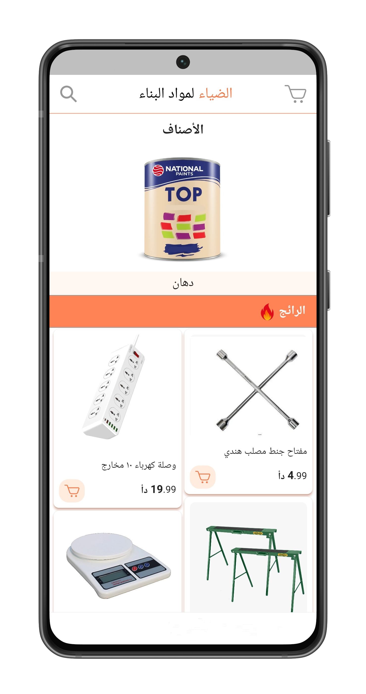
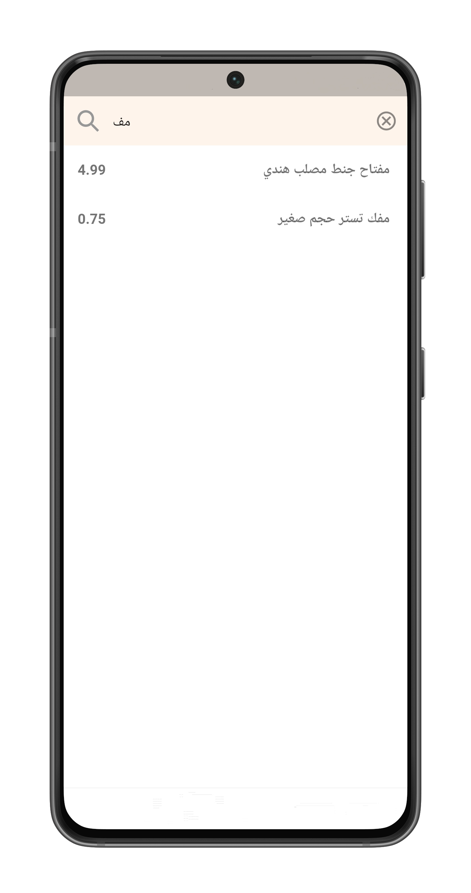
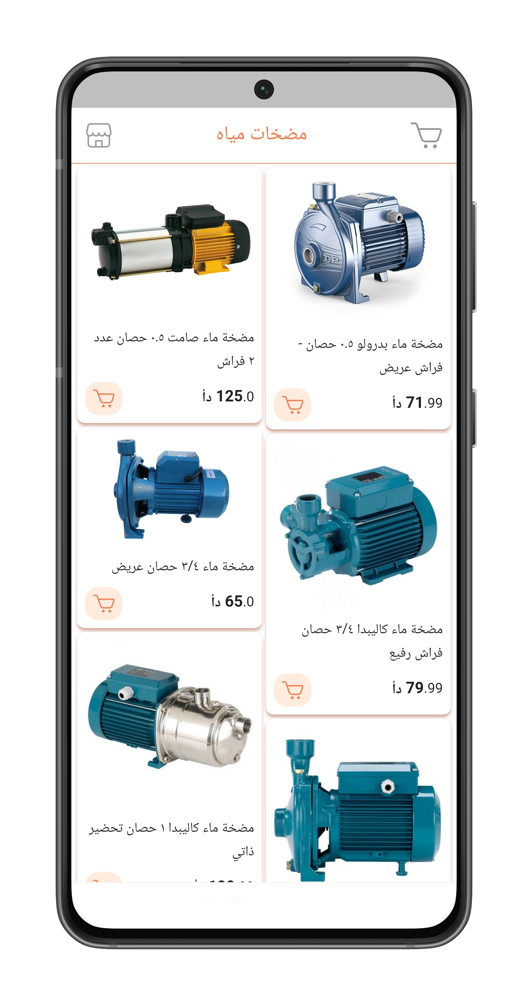
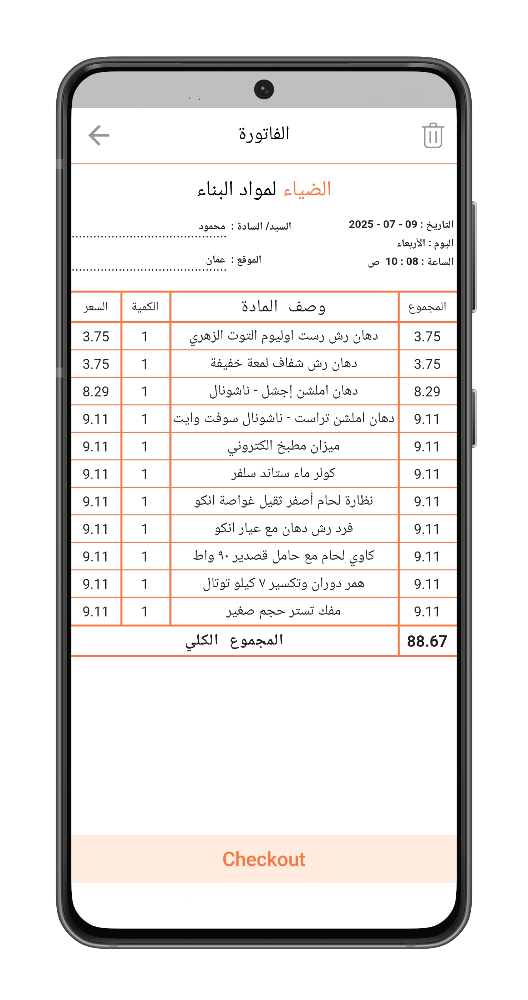
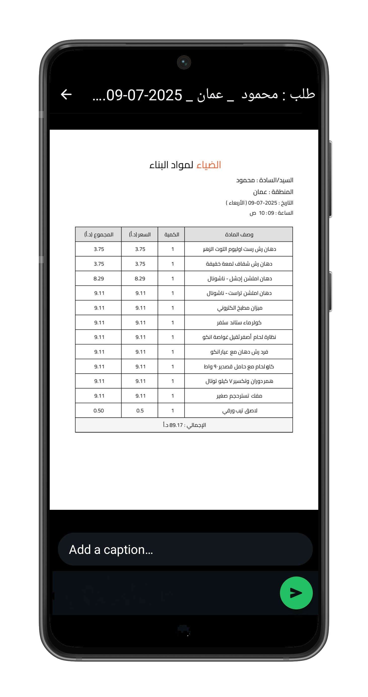

# 🏪 Al-Diea Sales App

This mobile application is built for **sales representatives of the الضياء building materials store**.  
It is designed to streamline the sales process by enabling reps to efficiently **present products**, **record orders**, and **communicate directly with the warehouse**.

---

## ✨ Features

- 🔍 Browse and filter product catalog
- 📝 Record customer needs and orders
- 📤 Send orders instantly to the warehouse for preparation
- 📦 Product details with images and specs
- 🧾 View and track submitted orders
- 👤 Clean and simple user interface optimized for salesmen

---

## 📸 Screenshots

<table>
  <tr>
    <td align="center">
      <B>🏠 Home</B>
    </td>
    <td align="center"> 
      <B>🔍 Search</B>
    </td>
    <td align="center"> 
      <B>📦 Category</B>
    </td>
  </tr>
  <tr>
    <td align="center">
      
    </td>
    <td align="center">
      
    </td>
    <td align="center">
      
    </td>
  </tr>
</table>

<table>
  <tr>
    <td align="center">
      <B>🧾 Cart</B>
    </td>
    <td align="center"> 
      <B>📝 Warehouse</B>
    </td>
  </tr>
  <tr>
    <td align="center">
      
    </td>
    <td align="center">
      
    </td>
  </tr>
</table>

---

## 🔗 Download

You can download the latest release from the [Releases section](https://github.com/yousef-mahmoud-2002/Diea/releases/tag/v1.1.0)